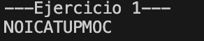
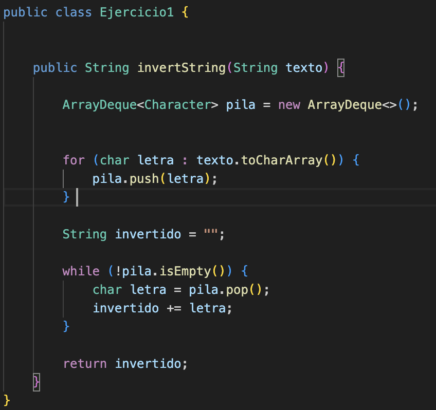

# Práctica: Estructuras Dinámicas Lineales

## Datos del Estudiante
- **Nombre:** Bryam Carchi
- **Curso:** Grupo 3 (Tarde)
- **Fecha:** 09/06/2026

---

## 1. Implementación de estructuras dinámicas lineales

**Fecha:** [08/06/2026]

**Descripción:**
En esta practica se uso las siguientes estructuras dinamicas lineales para realizar la inversion de una palabra:
*LinkedList
*Pilas con Stack y Deque
*Colas con Queue

### Captura de salida en consola


### Captura del código de implementación del ejercicio 1



o bloque de código .

```java
public String invertString(String texto) {
    ArrayDeque<Character> pila = new ArrayDeque<>();

 
        for (char letra : texto.toCharArray()) {
            pila.push(letra);
        } 
 
        String invertido = "";
 
        while (!pila.isEmpty()) {
            char letra = pila.pop();
            invertido += letra;
        }
 
        return invertido;

}
